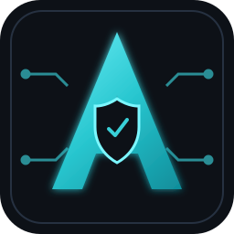

<div align="center">
  

  # Hi, I'm Ashot Simonyan

  **Junior Cybersecurity Specialist · Blue Team & SIEM · IT Support**

  <a href="mailto:simonyanashot5@gmail.com"></a>
  <a href="https://www.linkedin.com/in/ashot-simonyan-66934032a"></a>
  <a href="https://github.com/Ashotsim05"></a>
  
</div>

---

```text
I am a final-year Information Security student focused on Blue Team operations,
SIEM monitoring, systems administration, and secure network fundamentals.
I build scoped, reproducible security tooling and am open to full-time opportunities.
```

<div align="center">

### Featured project

<a href="https://github.com/Ashotsim05/TelepathIoT">
  
</a>

</div>

**TelepathIoT** is an isolated-lab MQTT broker assessment toolkit. It uses explicit target allowlists, action logs, rate limits, simulated devices, and human confirmation for intrusive checks—built to support responsible, authorized testing.

---

<div align="center">

### Security & systems


### Platforms & networking


### Development & workflow


</div>

---

## Experience focus

- Monitored and responded to simulated security incidents with **Splunk** and **Elastic Search**.
- Practised **DLP** and **WAF** controls to help protect sensitive data and web applications.
- Performed authorized vulnerability-assessment and penetration-testing exercises to identify and document security weaknesses.
- Built practical foundations in **Blue Team operations**, **EDR**, **IDS/IPS**, Active Directory, and defensive controls.
- Configured networks, resolved hardware and software issues, and supported end users in fast-paced environments.

## Education & training

- **Yerevan State University** — B.A. in Applied Mathematics and Informatics, Information Security section *(2023–2027)*
- **Global IT Academy** — Cybersecurity Program *(started December 2025)*
- **Hackvisor** — CORE Certificate in Cybersecurity

## Languages

Armenian (native) · English (B2) · Russian (B1)

---

<div align="center">
  <sub>All security work showcased here is intended for authorized environments only.</sub>
</div>
